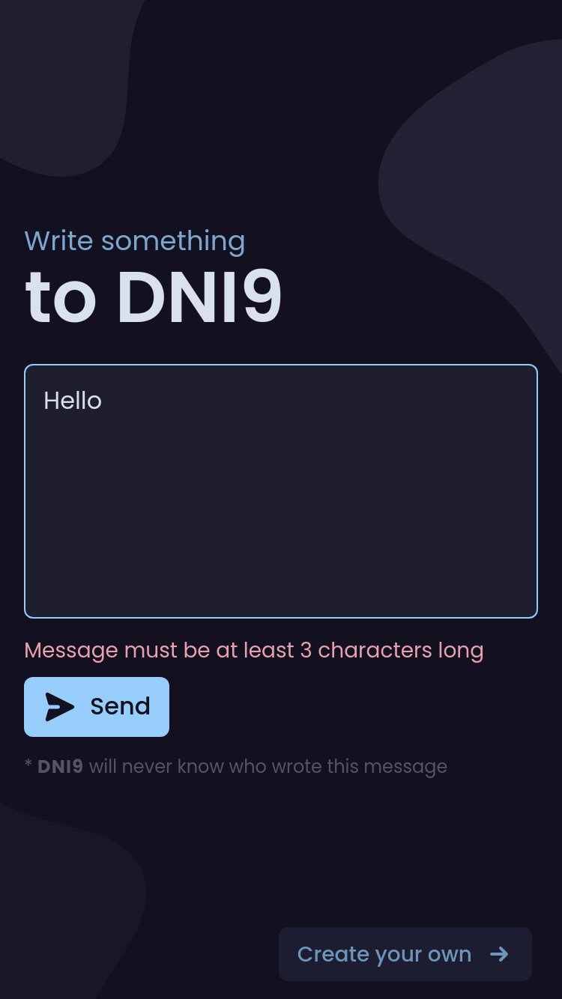
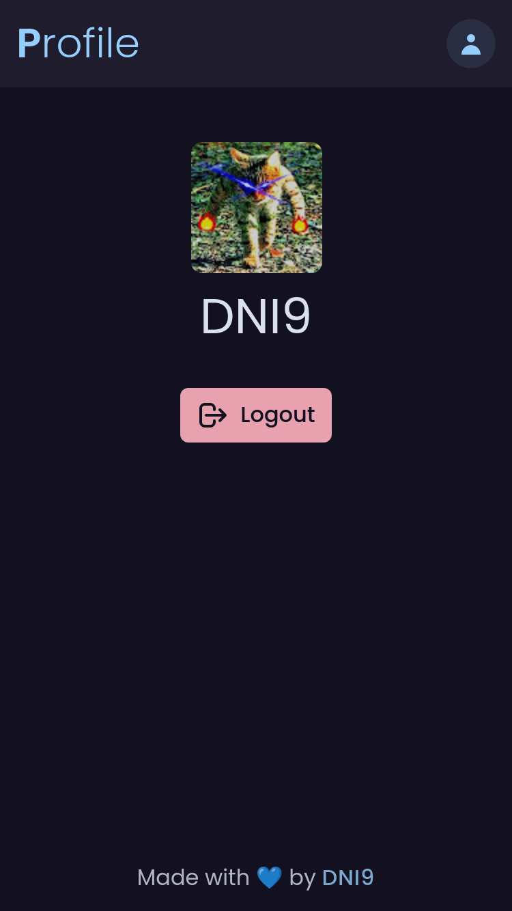

<div align="center">
  <h3 align="center">Your Secrets</h3>

  <p align="center">
    Create and share secret messages with friends
    <br />
    <a href="https://your-secrets.vercel.app"><strong>Open live app »</strong></a>
  </p>
	<a href="https://your-secrets.vercel.app">
		<div align="center">
			
			
			
			
		
		</div>
	</a>
</div>

## Screenshots

|                        |                       |                             |
| :--------------------: | :-------------------: | :-------------------------: |
|  |  |  |

|                              |                                |                               |
| :--------------------------: | :----------------------------: | :---------------------------: |
|  |  |  |

## Development

```sh
cp .env.example .env
```

Remember to set env vars to vercel as well

To run your Remix app locally, make sure your project's local dependencies are installed:

```sh
yarn install
```

Afterwards, start the Remix development server like so:

```sh
yarn dev
```

Open up [http://localhost:3000](http://localhost:3000) and you should be ready to go!

If you're used to using the `vercel dev` command provided by [Vercel CLI](https://vercel.com/cli) instead, you can also use that, but it's not needed.

## Deployment

[Import your Git repository](https://vercel.com/new) into Vercel, and it will be deployed.

If you'd like to avoid using a Git repository, you can also deploy the directory by running [Vercel CLI](https://vercel.com/cli):

```sh
npm i -g vercel
vercel
```

It is generally recommended to use a Git repository, because future commits will then automatically be deployed by Vercel, through its [Git Integration](https://vercel.com/docs/concepts/git).
